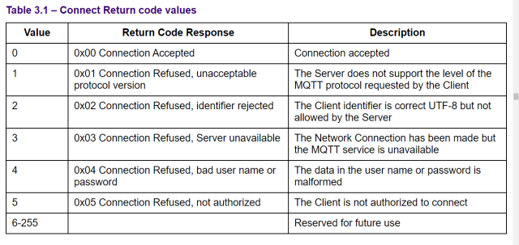

# ITUMIK_backend

## Notes
environment versiyonlama!
configleri mutlaka ayır

.env instance: 

MQTT_USERNAME = 
MQTT_PASSWORD = 
MQTT_CLUSTER_URL = 
MQTT_PORT = 
MQTT_CLIENT_ID = 
MQTT_KEEPALIVE = 

conda create -n <environment_name> python=3.10 pip --y
conda activate <environment_name>
pip install -r requirements.txt
cd main
python3 main.py